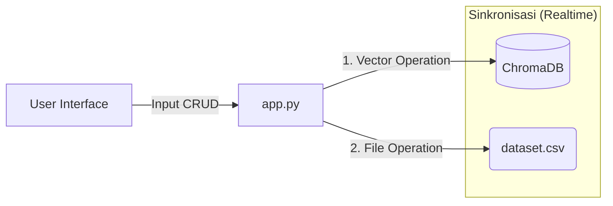

# Analisis Implementasi CRUD - Projek Chatbot Anime ChromaDB

Dokumen ini berisi analisis mengenai implementasi **CRUD (Create, Read, Update, Delete)** dalam proyek Chatbot Anime. Analisis ini ditujukan untuk membantu penyusunan laporan praktikum.

## 📂 File Utama yang Terlibat

| Nama File | Peran dalam CRUD |
| :--- | :--- |
| **[app.py](file:///e:/Semester%203/Basis%20Data/Projek%20UAS/v1.Chatbot_ChromaDB/app.py)** | **pusat logika (Core Logic)**. Semua antarmuka pengguna (GUI) dan eksekusi fungsi CRUD berada di sini. |
| **[dataset_anime_indonesia.csv](file:///e:/Semester%203/Basis%20Data/Projek%20UAS/v1.Chatbot_ChromaDB/dataset_anime_indonesia.csv)** | **Penyimpanan Data Mentah (Persistent Storage)**. File ini menyimpan data dalam format tabel yang mudah dibaca dan disinkronkan setiap kali ada perubahan. |
| **`./my_db_anime/`** | **Vector Database (ChromaDB)**. Direktori ini menyimpan data dalam bentuk vektor (embedding) untuk pencarian semantik yang cepat. |

---

## 🛠️ Rincian Operasi CRUD

Berikut adalah pemetaan operasi CRUD ke dalam kode program yang ada di [app.py](file:///e:/Semester%203/Basis%20Data/Projek%20UAS/v1.Chatbot_ChromaDB/app.py):

### 1. **C**REATE (Menambah Data)
*   **Lokasi Fitur**: Tab "➕ Tambah" di halaman `Kelola Database`.
*   **Kode Python ([app.py](file:///e:/Semester%203/Basis%20Data/Projek%20UAS/v1.Chatbot_ChromaDB/app.py))**:
    *   **Input**: User mengisi form (Judul, Genre, Sinopsis).
    *   **ChromaDB**: `collection.add()` digunakan untuk menyimpan vektor dan metadata ke database vektor.
    *   **CSV Sync**: Fungsi [sync_add_csv()](file:///e:/Semester%203/Basis%20Data/Projek%20UAS/v1.Chatbot_ChromaDB/app.py#44-53) (buatan sendiri) menambahkan baris baru ke akhir file CSV.
    *   **Visual**: Spinner "⏳ Menyimpan data..." memberikan feedback proses.

### 2. **R**EAD (Membaca/Mencari Data)
*   **Lokasi Fitur**: 
    1.  Tab "Chat AI" (Mencari konteks jawaban).
    2.  Tab "✏️ Edit" & "🗑️ Hapus" (Mencari data untuk diedit/dihapus).
*   **Kode Python ([app.py](file:///e:/Semester%203/Basis%20Data/Projek%20UAS/v1.Chatbot_ChromaDB/app.py))**:
    *   **ChromaDB**: 
        *   `collection.query()`: Digunakan untuk pencarian berbasis kemiripan (semantic search). Ini inti dari fitur "Read".
        *   `collection.get()`: Digunakan untuk mengambil detail spesifik berdasarkan ID saat tombol "Edit" diklik.
    *   **Pagination**: Logika pembacaan data dipecah (slice) menjadi 10 item per halaman menggunakan slicing list Python `[start:end]`.

### 3. **U**PDATE (Mengubah Data)
*   **Lokasi Fitur**: Tab "✏️ Edit (Update)".
*   **Kode Python ([app.py](file:///e:/Semester%203/Basis%20Data/Projek%20UAS/v1.Chatbot_ChromaDB/app.py))**:
    *   **Alur**: User mencari data -> Klik tombol "Edit" -> Form terisi data lama -> User mengubah isian -> Klik "Simpan".
    *   **ChromaDB**: `collection.update()` menimpa data lama (vektor & metadata) dengan data baru berdasarkan ID yang sama.
    *   **CSV Sync**: Fungsi [sync_update_csv()](file:///e:/Semester%203/Basis%20Data/Projek%20UAS/v1.Chatbot_ChromaDB/app.py#54-70) mencari baris dengan ID yang sesuai di CSV menggunakan *Pandas*, lalu menyimpan ulang file CSV.

### 4. **D**ELETE (Menghapus Data)
*   **Lokasi Fitur**: Tab "🗑️ Hapus (Delete)".
*   **Kode Python ([app.py](file:///e:/Semester%203/Basis%20Data/Projek%20UAS/v1.Chatbot_ChromaDB/app.py))**:
    *   **Alur**: User mencari data -> Klik "Hapus" -> Muncul Konfirmasi "Yakin?" -> Klik "Ya".
    *   **ChromaDB**: `collection.delete()` menghapus vektor dan metadata dari index pencarian secara permanen.
    *   **CSV Sync**: Fungsi [sync_delete_csv()](file:///e:/Semester%203/Basis%20Data/Projek%20UAS/v1.Chatbot_ChromaDB/app.py#71-83) memuat CSV ke Pandas, memfilter (membuang) baris dengan ID tersebut, lalu menyimpan ulang.

---

## 🔗 Diagram Alur Data (Sederhana)

## 📝 Kesimpulan untuk Laporan
Sistem ini menerapkan **"Dual-Storage Strategy"**:
1.  **ChromaDB** menangani operasi "Berat" (Pencarian Cerdas/Semantic Search).
2.  **CSV** berfungsi sebagai "Backup" dan data master yang mudah dibaca manusia.
Implementasi CRUD terjadi secara **Atomic**: satu aksi user memicu update di KEDUA tempat penyimpanan tersebut sekaligus untuk menjaga konsistensi data.
